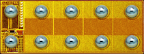
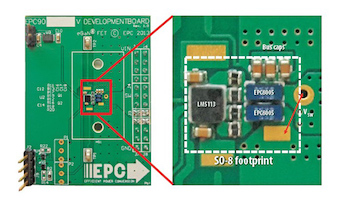
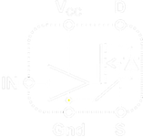
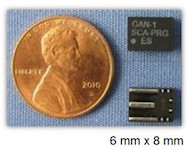
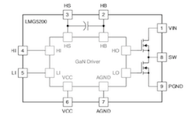
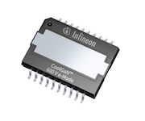

# [2018 Q2] GaN Technology Based Power Device Survey Report    

## About this document
* ### This document summarizes candidates of GaN technology based power devices for the next generation AC-Servo driver.
* ### This survey focuses on power devices for 48V power-train application.
* ### High voltge deveices (i.e 600V Vds devices) are out of scope. 
---
## Representative GaN power device manufacturers

* __EPC__(US)  
        
* __TI__(US)  
     
* __GaN Systems__(Canada)  
 
* __Infineon__(Germany)  
   
* __Panasonic__(Japan)  
     
* __Transphorm__(US)  
    
* __Navitas__(US)  
 
---

## Released Power Devices
* ### The following shows already released GaN technology based power devices
## EPC : [eGaN FET](https://epc-co.com/epc/Products/eGaNFETsandICs.aspx "eGaN FET")
  
 
* ### __Vds : 60V__
| Product No. | Type | Id [A] | Rds [mOhm]| Qg [nC] | Qgs [nC] | Qgd [nC] | Qoss [nC] |
|:-----------:|:----:|:------:|:---------:|:-------:|:--------:|:--------:|:---------:|
| EPC2031 | Single | 48 | 2.6 | 16 | 5 | 3.2 | 48 |
| EPC2020 | Single | 90 | 2.2 | 16 | 3.9 | 2.3 | 50 |
| EPC2102 | Half-Bridge | 30 | 4.9 | 8 | 2.5 | 1.5 | 26/31 |
| EPC2101 | Half-Bridge | 10/40 | 11.5/2.8 | 3.3/13 | 1.1/3.9 | 0.5/2.2 | 9.3/45 |

* ### __Vds : 80V__
| Product No. | Type | Id [A] | Rds [mOhm]| Qg [nC] | Qgs [nC] | Qgd [nC] | Qoss [nC] |
|:-----------:|:----:|:------:|:---------:|:-------:|:--------:|:--------:|:---------:|
| EPC2039 | Single | 6.8 | 25 | 1.91 | 0.76 | 0.42 | 7.64 |
| EPC2202 | Single(AEC) | 18 | 17 | 3.2 | 1 | 0.55 | 18 |
| EPC2029 | Single | 48 | 3.2 | 13 | 3.4 | 1.9 | 53 |
| EPC2021 | Single | 90 | 2.5 | 15 | 3.4 | 2.3 | 63 |
| EPC2103 | Half-Bridge | 30 | 5.5 | 6.5 | 2.2 | 1.1 | 30/34 |

* ### __Vds : 100V__
| Product No. | Type | Id [A] | Rds [mOhm]| Qg [nC] | Qgs [nC] | Qgd [nC] | Qoss [nC] |
|:-----------:|:----:|:------:|:---------:|:-------:|:--------:|:--------:|:---------:|
| EPC2007C | Single | 6 | 30 | 1.6 | 0.6 | 0.3 | 8.3 |
| EPC2016C | Single | 18 | 16 | 3.4 | 1.1 | 0.55 | 16 |
| EPC2045  | Single | 16 | 7 | 5.2 | 1.7 | 1.1 | 21 |
| EPC2001C | Single | 36 | 7 | 7.5 | 2.4 | 1.2 | 31 |
| EPC2032  | Single | 48 | 4 | 12 | 3 | 2 | 66 |
| EPC2022  | Single | 90 | 3.2 | 13.2 | 3.4 | 2.4 | 71 |
| EPC2104  | Half-Bridge | 30 | 6.8 | 6.8 | 2.3 | 1.4 | 35/41 |
---

## EPC : eGaN IC
 
* ### __Vds : 200V__
| Product No. | Type | Id [A] | Rds [mOhm]| Qg [nC] | Qgs [nC] | Qgd [nC] | Qoss [nC] |
|:-----------:|:----:|:------:|:---------:|:-------:|:--------:|:--------:|:---------:|
| EPC2112 | Integrated Gate Driver | 10 | 40 | N/A | N/A | N/A | 24 |
* ### Features  
    * ### Up to 7 MHz switching operation
    * ### 2.9mm * 1.1mm BGA
        
### [Data Sheet: EPC2112](DataSheets/EPC/EPC2112.pdf "Data Sheet")  
---

## TI : [GaN FET Modul](http://www.ti.com/power-management/gan/fet-modules/products.html "GaN FET Modul")
  
* ### ___Vds : 80V___
| Product No. | Type | Id [A] | Rds [mOhm]| Qg [nC] | Qgs [nC] | Qgd [nC] | Qoss [nC] |
|:-----------:|:----:|:------:|:---------:|:-------:|:--------:|:--------:|:---------:|
| LMG5200 | Half-Bridge Integrated Gate Driver | 10 | 15 | N/A | N/A | N/A | 266 | 
* ### Features
    * ### Gate driver capable of up to 10MHz switching 
    * ### Minimized gate parasitic inductance thanks to optimized integrated package  
    * ### Internal bootstrap power system for high-side gate drive  

### [Data Sheet: LMG5200](DataSheets/TI/LMG5200.pdf "Data Sheet")  
### [Application Note: TIDA-00915](ApplicationNotes/TI/TIDA-00915.pdf "Application Note ")  
---

## GaN Systems : [GaNPX E-HEMT](https://gansystems.com/gan-transistors/ "GaNPX E-HEMT")
 
* ### __Vds : 100V__
| Product No. | Type | Id [A] | Rds [mOhm]| Qg [nC] | Qgs [nC] | Qgd [nC] | Qoss [nC] |
|:-----------:|:----:|:------:|:---------:|:-------:|:--------:|:--------:|:---------:|
| GS61004B | Single | 45 | 15 | 6.2 | N/A | N/A | N/A | 
| GS61008P | Single | 90 | 7 | 12 | N/A | N/A | N/A |
| GS61008T | Single | 90 | 7 | 12 | N/A | N/A | N/A |
| GS-010-120-1-P | Single | 120 | 5 | 18 | N/A | N/A | N/A |

---
## Infineon : [CoolGan](https://www.infineon.com/cms/en/product/promopages/gallium-nitride/ "CoolGaN")  
 
* ### __Vds : 600V__
### Low Vds models have not been released yet. 
---

## Panasonic : [X-GaN FET](https://industrial.panasonic.com/ww/products/semiconductors/powerics/ganpower/gan-power-devices?reset=1 "X-GaN FET")  
 
* ### __Vds : 600V__
### Low Vds models have not been released yet.
---
## Summary
* ### To be described

